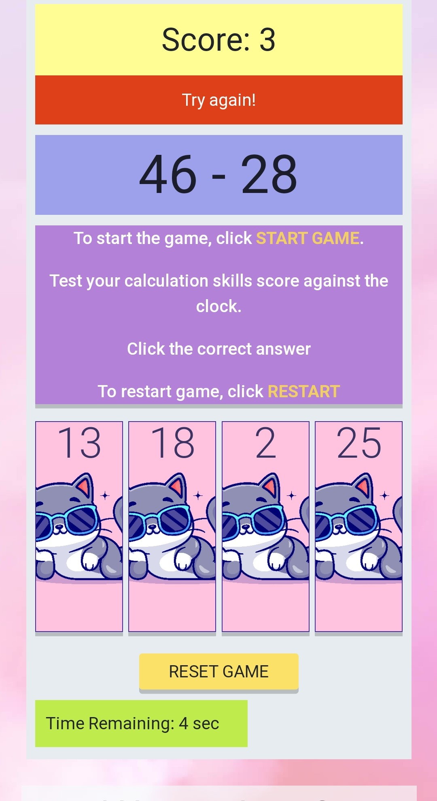
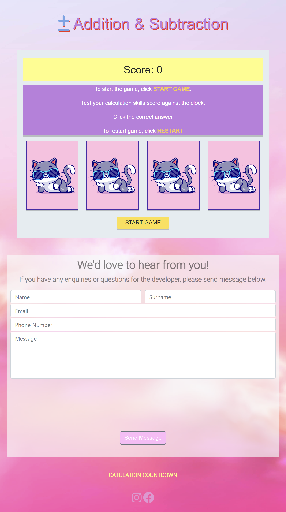

# Catculation Countdown 

  

## Project Overview 

**Catculation Countdown**  is a website developed from the idea from the Love Maths project. The inspiration came from my daughter's love of learning maths and cats, especially addition and subtraction sums in school and at home.

I have designed the website to look child friendly as its main focus. It is designed to be fully responsive and accessible on a range of devices, making it easy to navigate for children and parents. 

The goal of the website is a simple addition and subtraction game, where the user is played against a timer with a multiple choice answers. 

**Link to website** [here](https://stran90.github.io/Milestone-project-2/).

---

## CONTENTS

* [User Experience](#user-experience-ux)
  * [User Stories](#user-stories)

* [Design](#design)
  * [Colour Scheme](#colour-scheme)
  * [Typography](#typography)
  * [Imagery](#imagery)
  * [Wireframes](#wireframes)
  * [Features](#features)
  * [Future Implementations](#future-implementations)
  * [Accessibility](#accessibility)

* [Technologies Used](#technologies-used)
  * [Languages Used](#languages-used)
  * [Frameworks, Libraries & Programs Used](#frameworks-libraries--programs-used)

* [Testing](#testing)
  * [Manual Testing](#manual-testing)

* [Deployment & Local Development](#deployment--local-development)
  * [Deployment](#deployment)
  * [Local Development](#local-development)
    * [How to Fork](#how-to-fork)
    * [How to Clone](#how-to-clone)

* [Credits](#credits)
  * [Content](#content)
  * [Media](#media)
  * [Acknowledgments](#acknowledgments)

---

## User Experience (UX)

### User Stories

#### Target Audience

- A parent/care giver looking for a maths game for child in their care. 
- Child looking for a fun game to test their math skills. 

#### First-time Visitor Goals 
- As a first time user, I want to see short information about the instruction of the game.
- As a first time user, I want to be able to reset the game, timer and score recorded, so that I can start a new game.
- As a first time user, I want to know if my choosen answer is correct or incorrect.  
- As a first time user, I want to have fun and see a design to keep my attention. 
- As a first time user, I want to be able to see the timer and score. 
- As a first time user, I want to be able to contact the the developer for questions. 

#### Returning User Visitor Goals
- As a returning user, I want the game to play exactly the same as the last time I played it, so that I can improve my maths skills.
- As a returning user, I want to be able to easily contact the developer.

### Responsive Web Design

#### Website is fully responsive, with use of 4 breakpoints:

- 375px - mobile size,
- 768px - tablet size,
- 1440px - desktop size,
- 1950px - desktop large size.

## Design

### Colour Scheme

The website uses a mixture of colours thats bright and attractive, I wanted to choose colours to reflect the creative personality of the cat character and my daughter favourite colours. 

### Typography

- [Google Fonts](https://fonts.google.com/)

  - Used 'Roboto': "light 300", sans-serif and  font for the website as it great for accessibility.
  

### Imagery

Images were used from Freepik.com 

### Wireframes

Wireframes were created for mobile, tablet and desktop. 

### Features

The maths game is composed of one webpage. The page on the website will have:

- An simple and colourful page structure so that the user can easily start the game.
- "Start" button - starts the game for the user.
- Instructions of how to play.
- "Reset" button - user can reset the game and play again.
- "Game Over Feature" - after the timer reaches to 0 sec, a game over window appears showing the score the user has achieved. 
- Contact form - user can contact the game provider if they has questions or suggestions for the game.
- Footer - contains social media links. Icons were used to keep the footer clean and because they are universally recognisable. 

**Title**
- Located at top of the page.  
  
**Score Area**
- Area where the user can visually see their score each time they choose correct answer from multiply choice.   

**Game Area**
- This section gives instructions of how to play the game. Also where the question will appear when the game is started. 

**Multiple answer choices**
- This section shows four answers to the question at hand. Only one is correct, once the correct answer is clicked on a new question appears. A different cat noise sounds for incorrect or correct answer choosen. 

**Start Game section**
- When the user clicks on this, the game starts by a question appearing and the timer counts down from 60 seconds.
- After the game has started, this button changes to RESET GAME. 
- If user clicks on the RESET GAME button, a window message appears to let user know if they want to confirm to rest game or cancel. 

**Contact Form**
- Allows the user to contact the game provider if they has questions or suggestions for the game.

**Footer**
- Contains social media links. 

### Future Implementations.

  * Add more levels to increase difficulty. For example, larger sums or division and multiplication levels. 
  * Send email notification to user once form has been submitted. 
  * Background soundtrack for the game, to engage the user more. 

### Accessibility 

I have been mindful during coding to ensure the website is as accessible friendly as possible. I have achieved this by:

* Using semantic HTML.
* Ensuring there are sufficient colour contrast throughout the site.
* Using font style with good accessibility.

---

## Technologies Used

### Languages Used

- HTML
- CSS
- JavaScript

### Frameworks, Libraries & Programs Used

Balsamiq - Used to create wireframes. 

Bootstrap version 4.2.1 - The Framework for the website. Code used for additional CSS styling was also implemented in style.css. 

[Gitpod](https://gitpod.io/) - Open source developer platform, an IDE running in the Cloud. 

[Git](https://git-scm.com/) - Version control tool for tracking changes in code.

[GitHub](https://github.com/) - Hosting service for software development and version control using Git, to save and store files for the website. 

[FontAwesome](https://fontawesome.com/) - Iconography on the website

[Lighthouse](https://developer.chrome.com/docs/lighthouse/overview/) - Used to audit the site for performance, quality, best practices and SEO.

[Am I Responsive?](https://ui.dev/amiresponsive/) - An online tool to check how responsive the website is on different devices. Screenshot generated by the tool is presented in about section of the README file.

[Markup Validation Service](https://validator.w3.org/) - Validator checks the markup validity of Web documents in HTML, XHTML, SMIL, MathML, etc.

[CSS Validation Service](https://jigsaw.w3.org/css-validator/) - Online tool validates CSS files as CSS level 3 + SVG.

Google Dev Tools - To troubleshoot and test features, solve issues with responsiveness and styling. 

[Favicon Converter](https://favicon.io/favicon-converter/) - Online site to convert the file type of WEBP, JPEG and PNG files into favicon files. 

[Tinypng](https://tinypng.com) - Online site to reduce the file size of your WEBP, JPEG and PNG files. 

[JSHINT](https://jshint.com/) - A Static Code Analysis Tool for JavaScript. 

[Coolors](https://coolors.co/) - Colour palettes generator. 

## Testing

Testing was ongoing throughout the entire build. I utilised Google Chrome developer tools while building to pinpoint and troubleshoot any issues as I went along.
Each device has been inspected using Google Chrome developer to ensure each page is fully responsive on a variety of different screen sizes and devices. I have also physically tested the responsiveness of the site on a number of different devices and tested the game on my daughter. 

### Manual Testing 

#### Ensure that all user stories are achieved

For parents:

* When entering the webpage, the parent can easily see the bright,. attractive colours, images and content of the page.
* Seeing short, clear instructions, the child can read game instructions easily.
* The game is fun and challenging for kids. Cheerful image of the cool cat make it fun, while score counter and timer makes it challenging.

For user:

* The game is fun for kids. Images of cool cat, score counter and timer makes the game fun and challenging.
* The Maths game is designed in bright and colourful colours.
* Mulitple choice makes the games more focused and helpful. 
* The images are cool and cheerful, easily capturing the user's attention
* A score counter and timer are placed above and below the play area so that the user can see their score and time left they have during the game.

#### Game Starts

  

* Click on START GAME button, the game starts and timer starts incrementing down by 1 second. 
* START GAME button changes to RESET GAME. 
* Question area appears with a sum. 
* 4 mulitple possible answers are seen on the cool cat images boxes

### Message and sound for incorrect answer

  

* When incorrect answer is clicked on a 'noo' cat meow can be heard. 
* A message saying Try again! can be seen under the scoreboard, above the question area. 

### Meassage and sound for correct answer

  

* When correct answer is clicked on a cat meow can be heard (different from the other cat sound for incorrect). 
* A message saying Correct! can be seen under the scoreboard, above the question area. 

### RESET GAME button

  

* When the RESET GAME is clicked on, a window message appears for the user to confirm they want to reset the game. 
* If the user clicks on "Ok", the game restarts. 
* If the user clicks on "cancel", the action is cancelled and the current games resumes. 

### Game over message

  

* When the timer increments down to 0 seconds, a message appears to tell the user the game is over and shows them how many correct answers they have score. 

### Final Product

## Mobile View

## Tablet Device view

## Desktop view

### W3C Validator

The W3C validator was used to validate the HTML on all pages of the website. It was also used to validate CSS in the style.css file.

* [Webpage HTML](README.docs/w3c.png)
* [Webpage CSS](README.docs/w3c_css.png)

### Lighthouse

I used lighthouse to test each of the pages for:

- Performance - how the page performs whilst loading.
- Accessibility - how accessible is the site for all users and how can it be improved.
- Best practices - how does the site conform to industry best practices.
- SEO - search engine optimization. Is the site optimized for search engine result rankings.

Results can be accessed by this [link](https://pagespeed.web.dev/analysis/https-stran90-github-io-Milestone-project-2/29eflnzxjo?form_factor=mobile)

### Bugs and issues

1. The timer was decreasing too quickly and not at the correct interval. 

- Fixed this issue by implenting the startCountdown near the beginning of the code and changing the code so it calculates the remaining time based on the elapsed time since the start of the countdown. This approach should provide a more accurate timer. 

2. Timer keeps stopping at 1sec not 0sec. 

- Bug seen due to the interval timing. To ensure the timer displays 0 seconds when the game is over a small adjustment was made to the code. Bug fixed by clearing the interval when the timer reaches 0 seconds, by clearing the timerInterval when the game is reset. 

## Deployment & Local Development 

### Deployment

#### Gitpod

For website deployment I have decided to go with [Gitpod](https://gitpod.io) because it provides fast website load speeds, simple configuration setup and very easy deployment process.

- From the dashboard create new "Project",
- Login with GitHub,
- Import desired git repository,
- Configure project,
- Type "python3 -m http.server" into terminal 
- Select 'Open in new browser' when pop up appears. 
- Website deployed!

#### GitHub Pages

* Log into GitHub and locate the repository.
* At the top locate the settings option
* Scroll towards the bottom of the page and locate GitHub Pages
* Click on the link "Check it out here!"
* Under 'Source' dropdown, click 'Master' from the options.
* Click the save button.
* The site is now published, it may not be available immediately.
* The site URL is visible on the green bar under the "Github Pages".

### Local Development 

#### How to Fork

To fork the Catulation Countdown:

1. Log in (or sign up) to Github.
2. Go to the repository for this project, 
3. Click the Fork button in the top right corner.

#### How to Clone

To clone the Catulation Countdown repository:

1. Log in (or sign up) to GitHub.
2. Go to the repository for this project, https://github.com/STRAN90/Milestone-project-2.git
3. Click on the code button, select whether you would like to clone with HTTPS, SSH or GitHub CLI and copy the link shown.
4. Open the terminal in your code editor and change the current working directory to the location you want to use for the cloned directory.
5. Type 'git clone' into the terminal and then paste the link you copied in step 3. Press enter.

- - -

## Credits

### Content

Maths Game:

- [Code insitute] (https://github.com/Code-Institute-Solutions/love-maths-2.0-sourcecode/tree/master) Love Maths walkthrough project
- [Amey-Thakur] (https://github.com/Amey-Thakur/THE-MATH-GAME) - Github

Content for this project was written by Sonia Majewska.

###  Media

- Freepik - was used for background image and multiple choice answers imagery.  
- Myinstants - for sound files used for clicks on incorrect or correct answers. 

### Acknowledgments

- My mentor Rohit Sharma for his knowledge and helpful advice. 
- Google search engine for limitless resources about web development. 